summary: AWSアカウントを作成してみよう～ Presented by JAWS-UG 初心者支部 2022
id: docs
categories: AWS, Acount, Registration
environments: Web
status: Draft
feedback link: https://github.com/otanikohei/How_to_Sign_up_AWS_Account/settings

# AWSアカウントを作成してみよう～ Presented by JAWS-UG 初心者支部 ２０２２

## はじめに
Duration: 0:05:00

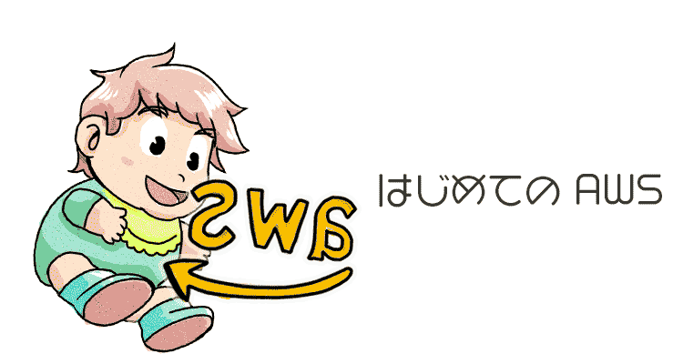

本ハンズオンは以下のような方をターゲットにしています。

- AWS アカウントを契約して使いたいけど、具体的な手順や詳細が分からない
- 手順は知っているけど、操作方法が分からなくなったときに質問できないのは不安
- 課金システムが分からない、高額請求が怖い

### 前提や注意点

<aside class="negative">アカウント作成の注意点についてはできる限り配慮していますが、保証・補償をする物ではございません。 </aside>

<aside class="negative">アカウント作成した後、運用次第では費用が発生する可能性があります。</aside>

### ご用意いただきたいもの

- メールアドレス
- クレジットカード／デビットカード
- SMS (ショートメッセージサービス) が届く携帯電話やスマートホンなどの機器
- Google Authenticator

## AWS の無料利用枠について

AWS には無料利用枠があります。一部のサービスが一定額まで無料であったり、期間限定で無料で体験できます。

[https://aws.amazon.com/jp/free](https://aws.amazon.com/jp/free)

以下は、無料枠の一部ですが有効期限が 12 ヶ月のものが多いので使えるうちに色々試してしまいましょう！ 

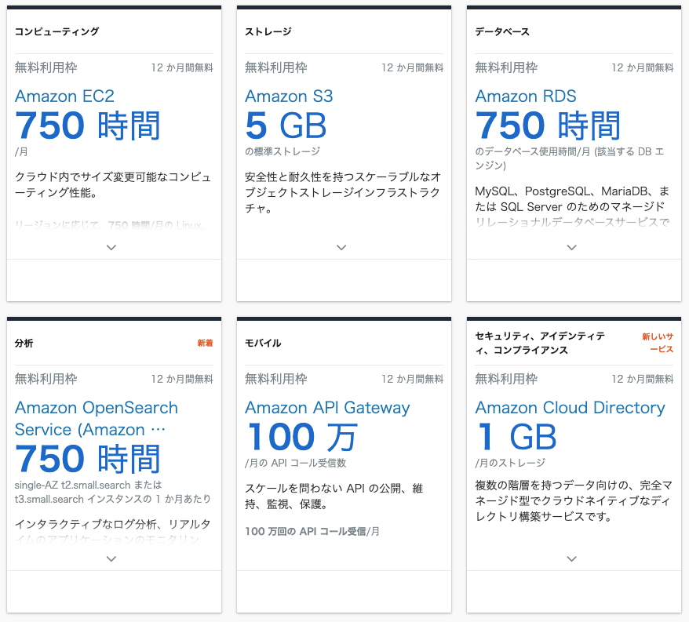

## AWS アカウント作成の流れ

Amazon Web Service (AWS) を利用するには、AWS アカウントの契約が必要です。

以下リンクをクリックすると、AWS アカウントを作る方法が画面のスクリーンキャプチャー付きで紹介されています。  
まずは、この手順に沿ってアカウントを作成してください。

[https://aws.amazon.com/jp/register-flow/](https://aws.amazon.com/jp/register-flow/)

## サインイン

アカウントができたらサインインしてみましょう。  
以下 URL からサインインできます。

[https://signin.aws.amazon.com/console](https://signin.aws.amazon.com/console)

以下の画面がサインイン画面が表示されたら、

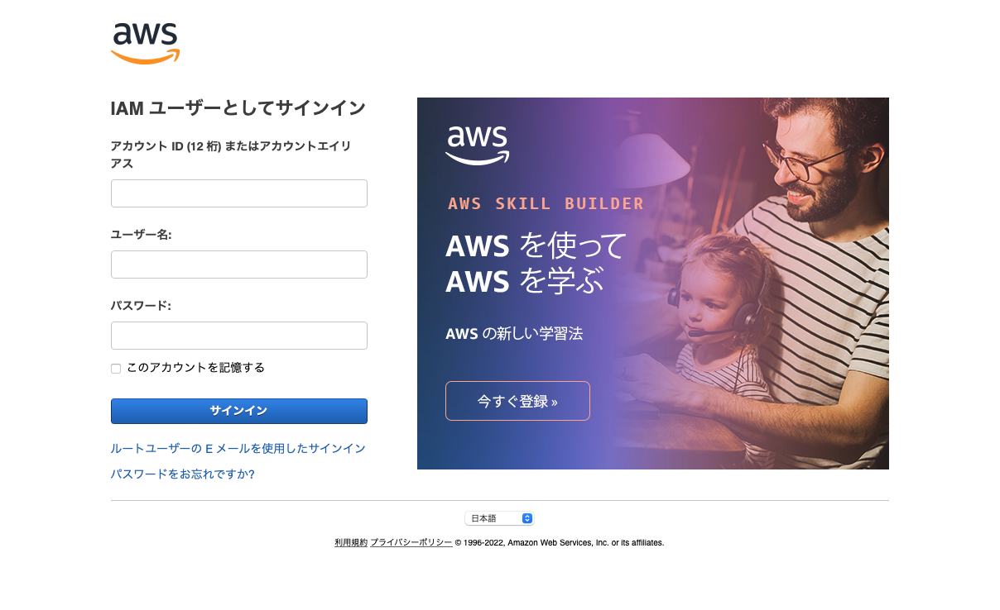

「ルートユーザーの E メールを使用したサインイン」のリンクをクリックしてください。

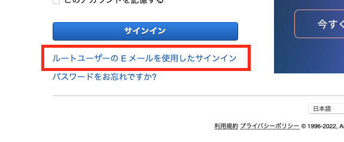

以下の画面に遷移しますので、[ **○ ルートユーザー** ] が選択されていることを確認し、**ルートユーザーの E メールアドレス** にメールアドレスを入力して、[ **次へ** ] ボタンをクリックしてください。

パスワードを入力する画面に遷移しますので、先ほど設定したパスワードでサインインしてください。

以下の画面が表示されたらサインイン成功です。

今後、他のハンズオンで「コンソール画面を開いて」と言われた場合は、この画面、またはこの画面から遷移する AWS サービスの画面のことだ、とご認識ください。

## マネジメントコンソールの構成

マネジメントコンソールの画面の構成について簡単に説明します。  

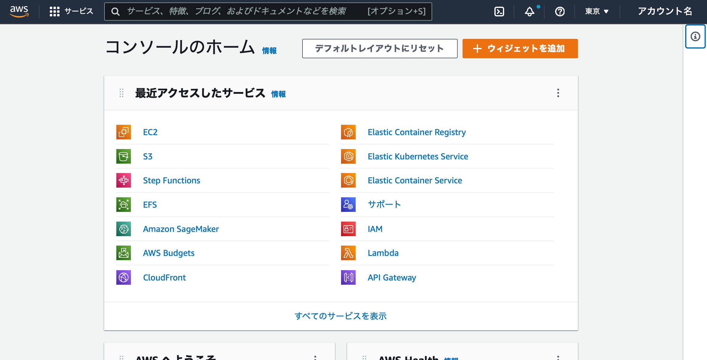

1. 左上の AWS のロゴをクリックすると、トップページが表示されます。  
  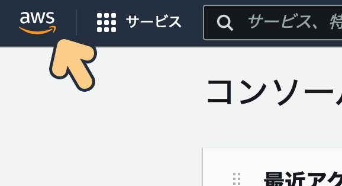
2. サービスをクリックすると、サービスの一覧が表示されます。  
  
3. テキストボックスにキーワードを入力すると候補が表示されます。例えば、api と入力すると、API Gateway が一番に表示され、次候補に API を記録する CloudTrail が表示されます。
  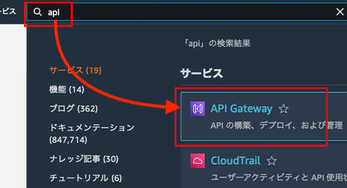
4. CloudShell のアイコンです。本ハンズオンでは取り上げませんが、AWS CLI を実行できます。
  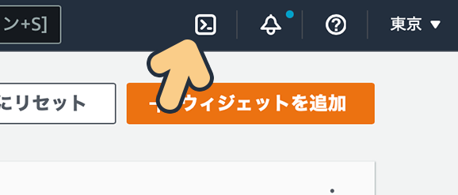
5. パーソナルヘルスダッシュボードです。メンテナンスのお知らせや障害などが通知されます。
  
6. サポートセンター へのリンクや、AWS IQ というエキスパートとコンタクトを取るためのツール、re:Post という新しいフォーラムなどにアクセスができます。
  
7. リージョンを選択できます。
  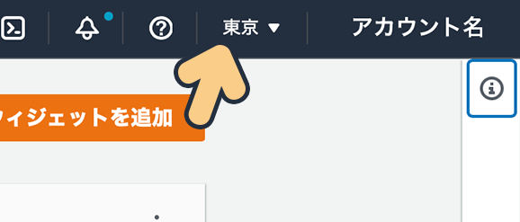
8. アカウント名をクリックすると、請求情報やセキュリティ情報、アカウント情報にアクセスできます。
  

## セキュリティ強化 - MFA

AWS アカウントを契約した際のメールアドレスが、**ルートアカウント** になります。  
ルートユーザーはアカウント内の全てのアクションを行うことができるので、アカウント内の神様とも言える権限があります。  

本ハンズオンでは、AWS アカウントの不正アクセスやアカウント乗っ取りなどの被害を防ぐため、**多要素認証（MFA）** を必須とさせていただいております。  

ユーザー名とパスワードに加えて、一時的な認証コードである MFA を合わせることでセキュリティを大幅に強化できます。

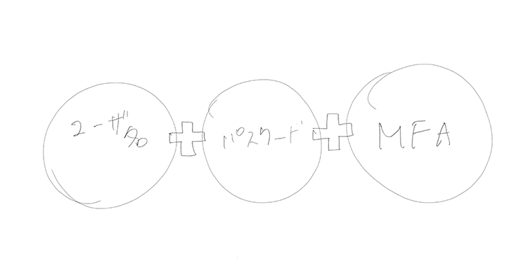

各自、App Store などで 「Google Authenticator」 で検索、ダウンロードをお願いします。

#### Google Authenticator

- Android の方：[Google Play](https://play.google.com/store/apps/details?id=com.google.android.apps.authenticator2&hl=ja&gl=US)  
- iPhone の方： [App Store](https://apps.apple.com/jp/app/google-authenticator/id388497605)

<aside class="negative">ハンズオン終了後も、Google Authenticator は削除しないでください！
AWS アカウントにログインができなくなります。 </aside>

<aside class="positive">Microsoft Authenticator や Authy などでも対応可能ですが、本ハンズオンでは環境を統一するために Google Authenticator にてご案内します。</aside>

### 二段階認証の設定

まとめますと、二段階認証は以下のために設定をします。

- アカウントの神様的権限を持つルートユーザーを盗られると大変
- メールアドレス、パスワード以外にもログイン時に必要な情報を追加すべき

AWS マネジメントコンソールを操作して、二段階認証を設定していきます。

アカウント名をクリックして、[ **セキュリティ認証情報** ] をクリックします。

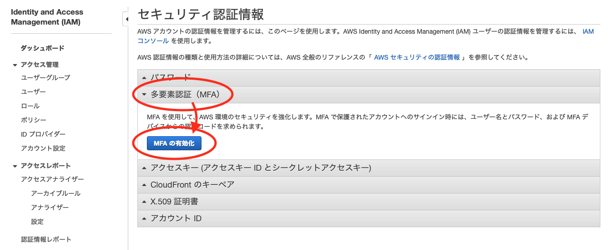

**セキュリティ認証情報** の画面に遷移するので、[ **多要素認証 (MDA)** ] にあります [ **MFA の有効化** ] ボタンをクリックしてください。

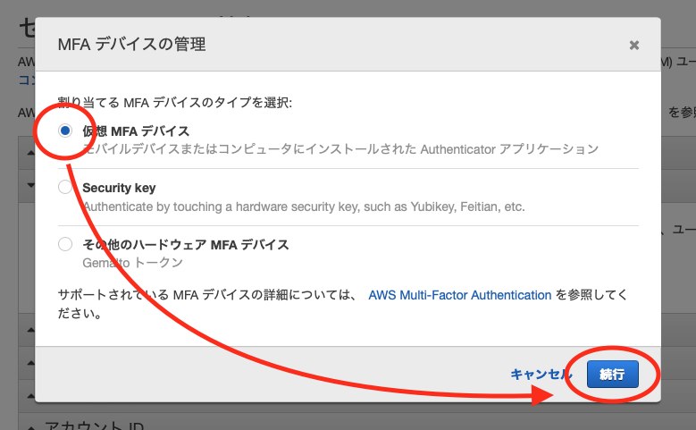

**MFA デバイスの管理** のダイヤログ画面が表示されるので、[ **仮想 MFA デバイス** ] が選択されていることを確認して、[ **続行** ] ボタンをクリックします。

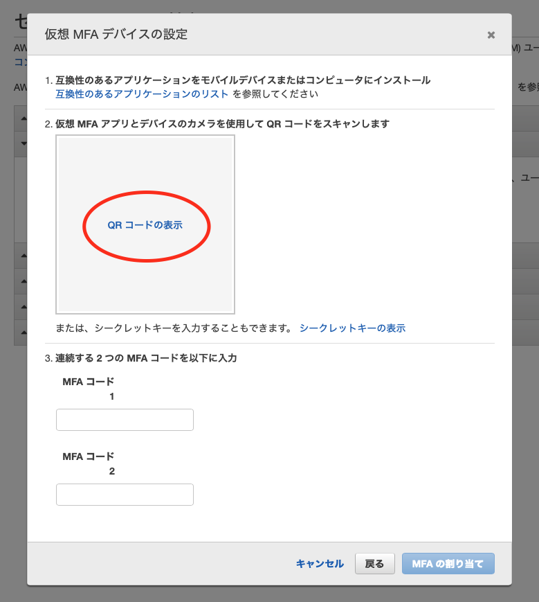

**MFA デバイスの設定** の画面に遷移するので、[ **QA コードの表示** ] というリンクをクリックしてください。  
QR コードが表示されます。

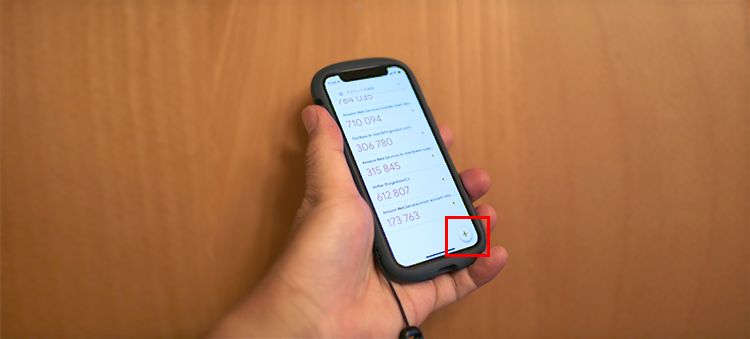

Google Authenticator アプリを開き、で読み込んでください。右下の [+] アイコンをタップして、

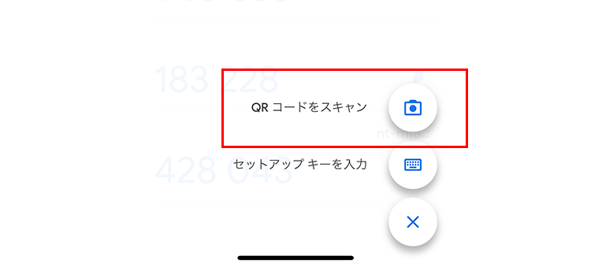

[QR コードをスキャン] をタップして、スマホで QR コードを読み込んでください。

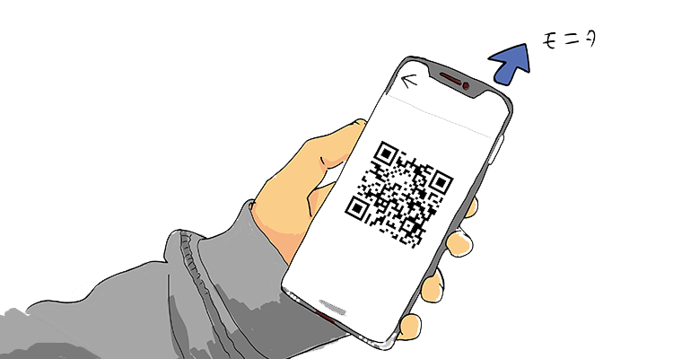

Google Authenticator から発行されたコードを 2 つ入力して、[ **MFA の割り当て** ] ボタンをクリックしてください。  
まず、表示されたコードを **MFA コード1** に入力してください。  
一定時間が過ぎると別の MFA コードが表示されるので **MFA コード2** に入力してください。

<aside class="positive">2 つのコードは連続させる必要があります。切り替わったタイミングで入力を行うとスムーズに進めることができます。</aside>

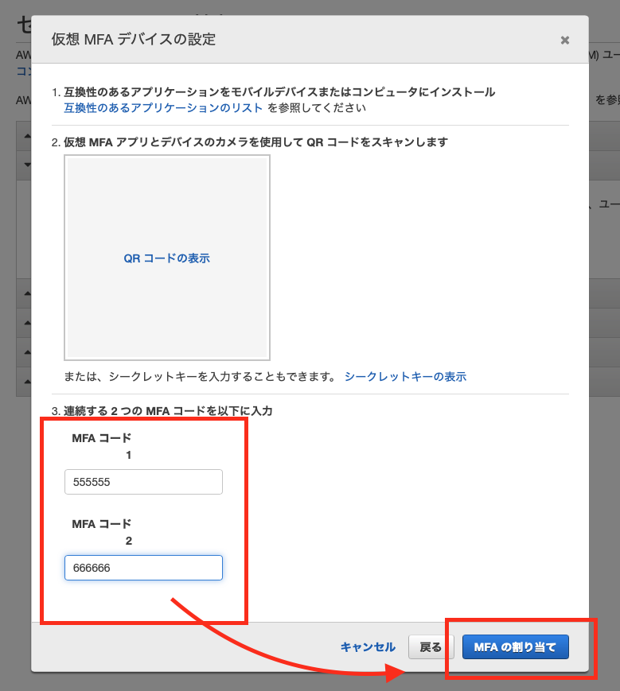

以下のメッセージが表示されたら成功です。

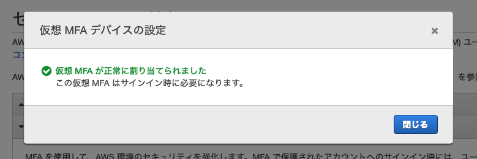

## セキュリティ強化 - IAM ユーザー

### ユーザーを追加しましょう

先ほど MFA を設定したルートユーザーはアカウントの神様的存在ですので、普段は使わないことがベストプラクティスとして推奨されています。  
普段使うユーザーは IAM というサービスから作成できます。

IAM ユーザーも盗られると権限によっては大きな被害を受けますので、MFA を設定してください。

### AWS IAM とは

AWS Identity and Access Management (IAM) は、誰がどのサービスやリソースに、どのような条件でアクセスできるかを指定することができる権限コントロールのためのサービスです。  
誰がどのような操作を行ったか証跡を取ることにも貢献します。

IAM には、大きく分けて 4 つの機能があります。

#### **ユーザーグループ**

ユーザーをとりまとめるための機能です。  
会社で例えると、部、課、チームのような概念です。

#### **ユーザー**

AWS を利用するユーザーを管理するための機能です。  
アプリケーションに操作を委ねるアクセスキーも発行できます。  
会社で例えるなら社員や社員証といったところです。

#### **ロール**

サーバーやプログラムに割り当てる権限情報です。  
会社で例えると、ID カードのようなものでしょうか。

#### **ポリシー**

上記、グループ、ユーザー、ロールに付与する具体的な権限の内訳です。  
操作を許可したり、禁止したりできます。  

#### **関係性**

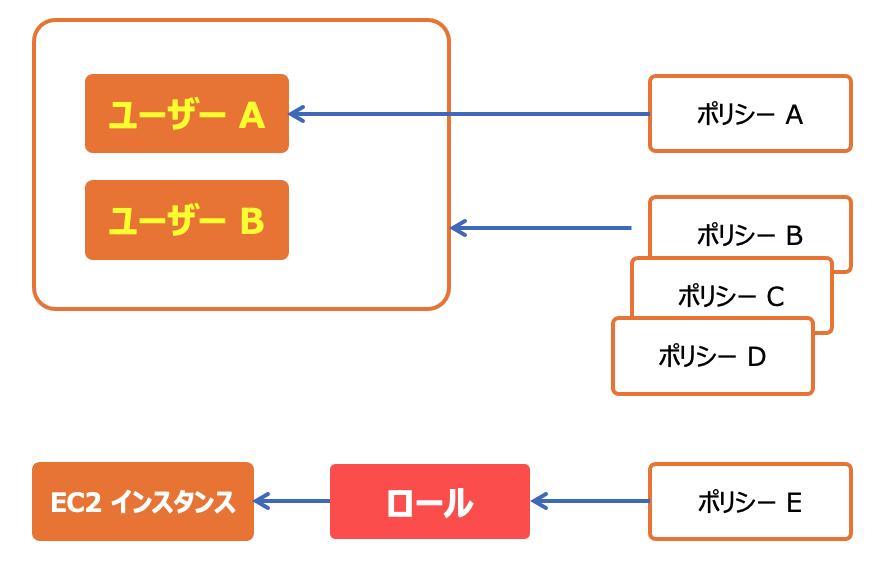

1. ポリシー A はユーザー A にのみ適用されます。
2. ポリシー B、C、D は、ユーザー A とユーザー B が含まれるグループに適用されます。
3. ポリシー E は、ロールにアタッチして、EC2 インスタンスにアタッチするとインスタンスにポリシー E の権限が付与できます。

#### IAM ユーザーを作成する

それでは、Administrator の権限を持つ IAM ユーザーを作成してみましょう。

IAM コンソールにアクセスしてください。  
検索ボックスに「iam」と入力して、候補をクリックするか、以下の URL をクリックして、CloudTrail コンソールにアクセスします。

[https://us-east-1.console.aws.amazon.com/iamv2/home](https://us-east-1.console.aws.amazon.com/iamv2/home)

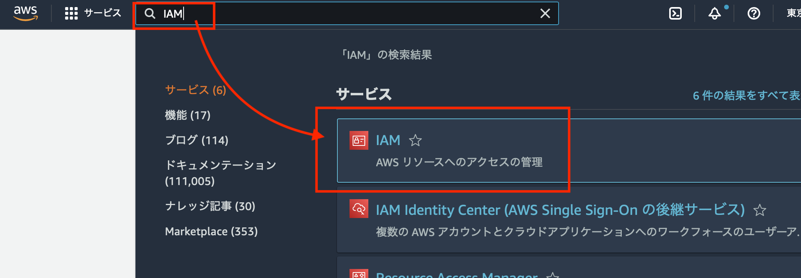

IAM コンソールに画面が遷移したら、左側のメニューペインから **ユーザー** をクリックします。

**ユーザー** の画面に遷移するので、[**ユーザーを追加**] ボタンをクリックします。

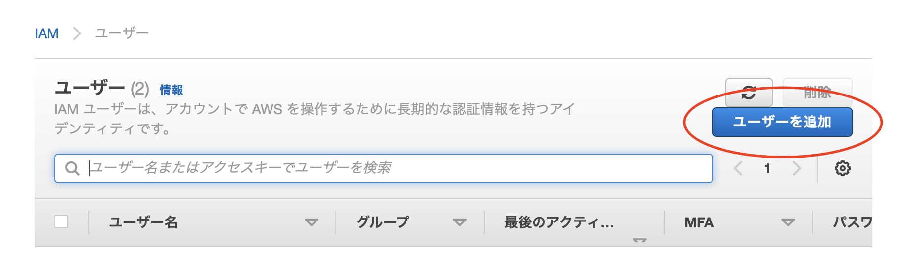

ユーザー名は任意です。  
以下のような例に従って、ユーザーを作成してください。

**例1:** handson_user  
**例2:** YamadaTaro

**パスワード - AWS マネジメントコンソールへのアクセス** のチェックボックスにチェックを入れてください。  
チェックを入れると、下部に **コンソールのパスワード** などが動的に表示されますが、変更せずに [**次のステップ: アクセス権限**] ボタンをクリックしてください。  

**アクセス許可の設定** に画面が遷移するので、[**既存のポリシーを直接アタッチ**] を選択し、検索ボックスに「AdministratorAccess」と入力します。  
[**ENTER**] キーを押下すると、候補に「AdministratorAccess」が表示されるので、チェックボックスにチェックを入れて、
[**次のステップ: タグ**] ボタンをクリックしてください。

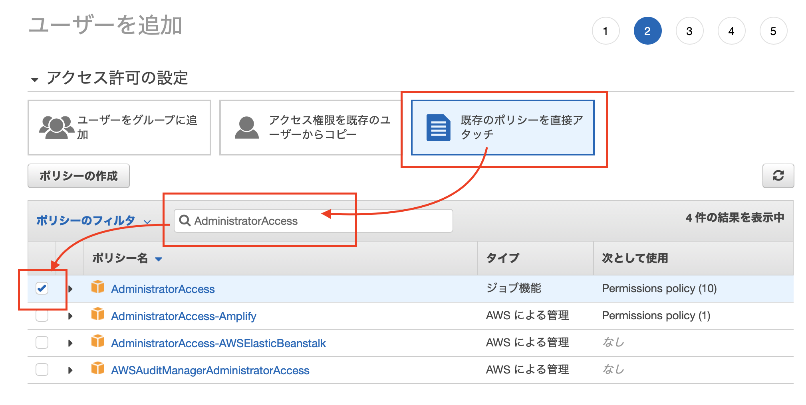

**タグの追加 (オプション)** に画面遷移するので何も入力せずに、[**次のステップ: 確認**] ボタンをクリックします。  
**確認** 画面に遷移するので、内容に不備がないか確認して [**ユーザーの作成**] ボタンをクリックします。

<aside class="positive">AdministratorAccess とは別に、IAMUserChangePassword が付与されています。IAMUserChangePassword は IAM ユーザーがパスワードを変更できる権限です。IAM ユーザー作成時に標準で授与されます。</aside>

ここで、必ず [**.csv のダウンロード**] ボタンをクリックして、認証情報をダウンロードしておいてください。  
これがないと、ログインパスワードが分かりません。  

ダウンロードができたら、[**閉じる**] ボタンをクリックします。

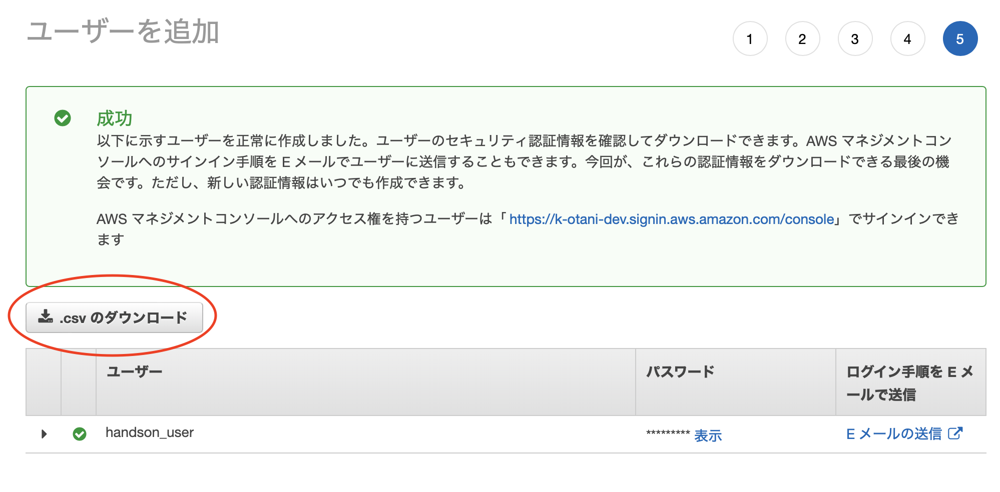

作成したユーザー名をクリックしてください。

#### MFA を有効化する

ルートユーザー同様、作成したユーザーも乗っ取られると大変なことになります。  
そのため、MFA を有効にしておきます。

[**認証情報**] タブを選択して、**MFA デバイスの割り当て** にある **管理** をクリックします。

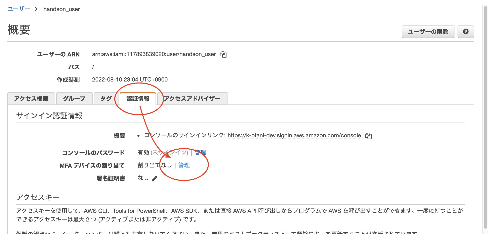

**MFA デバイスの管理** のダイヤログ画面が表示されるので、[ **仮想 MFA デバイス** ] が選択されていることを確認して、[ **続行** ] ボタンをクリックします。

Google Authenticator アプリを開き、で読み込んでください。右下の [+] アイコンをタップして、

Google Authenticator から発行されたコードを 2 つ入力して、[ **MFA の割り当て** ] ボタンをクリックしてください。  

以下のメッセージが表示されたら成功です。

MFA を有効化すると、以下のように MFA デバイスの割り当てが **なし** からリソース情報 (ARN といいます) に変わります。

<aside class="positive">作成したユーザーはユーザー一覧のページから確認できます。</aside>

ユーザー一覧のページ
[https://us-east-1.console.aws.amazon.com/iamv2/home#/users](https://us-east-1.console.aws.amazon.com/iamv2/home#/users)

## アカウントの確認とサインアウト

### AWS アカウントの確認

AWS アカウントは、数字 12 桁の数字で表現されます。  
画面上部でマイアカウントをクリックすると、確認できます。  

次作業で必要ですので、メモをしておいてください。

### サインアウト

AWS マネジメントコンソールでの操作を終えたらサインアウトをします。
画面上部をクリックして、サインアウトを選択します。

[https://aws.amazon.com/jp/cloudtrail/pricing/](https://aws.amazon.com/jp/cloudtrail/pricing/)

## IAM ユーザーでサインインする

作成した IAM ユーザーでサインインしてみましょう。

以下 URL にアクセスするか、表示されているようであれば [もう一度ログインする] ボタンをクリックしてください。

[https://signin.aws.amazon.com/console](https://signin.aws.amazon.com/console)

以下の画面に遷移しますので、[ **○ IAM ユーザー** ] が選択されていることを確認し、**アカウント ID (12 桁)　またはアカウントエイリアス** にアカウント ID を入力して、[ **次へ** ] ボタンをクリックしてください。

<aside class="positive">アカウント ID を控えるのを忘れた方は届いたメールを確認するか、ルートアカウントでサインインして確認してください。</aside>

アカウント ID、ユーザー名、パスワードを入力する画面に遷移しますので、パスワードを入力してサインインしてください。

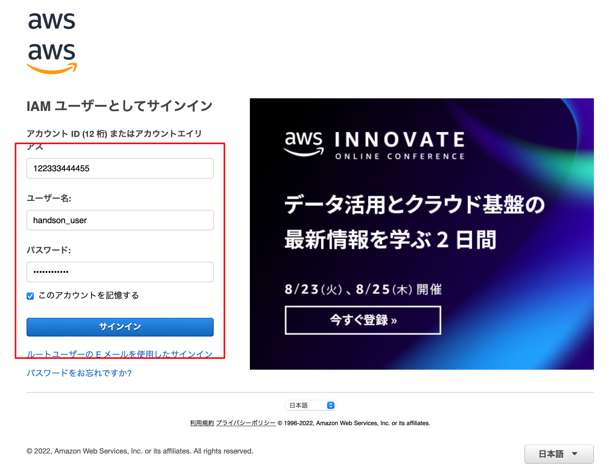

<aside class="positive">ユーザー名とパスワードはダウンロードした csv ファイルに記載されています。</aside>

以下の画面が表示されたらサインイン成功です。

今後、他のハンズオンで「コンソール画面を開いて」と言われた場合は、この画面、またはこの画面から遷移する AWS サービスの画面のことだ、とご認識ください。

## オプション 1 AWS CloudTrail

### CloudTrail の仕組み

AWS の各種サービスは「マネージメントコンソール」、「AWS CLI」、「SDK」、「他AWSサービス」から操作ができますが、ほとんどは API エンドポイントへアクセスします。

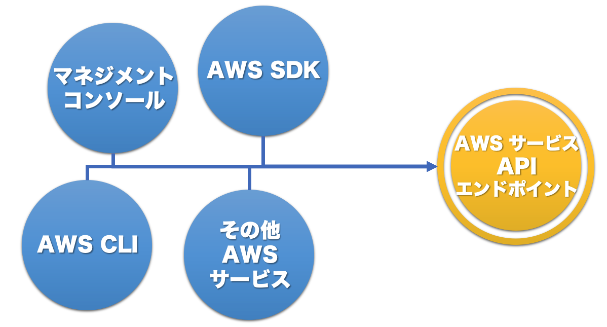

CloudTrail はこの AWS アカウント内で実行された API アクションを記録するサービスです。
例えば EC2 インスタンスを削除した場合だと以下などが把握できます。

- **Who?**  
  誰が EC2 インスタンスを削除したか追跡できます。
- **What?**  
  何台の EC2 インスタンス削除したか追跡できます。
- **Where？**  
  どこから削除の API が発信されたか？追跡できます。
- **When？**  
  いつ削除の API が送信されたか？追跡できます。

CloudTrail は有事の際に障害切り分けに利用できたり、不正アクセスかどうか判断する材料になったりと大変有効なサービスです。

### 無料枠で取得できないアクティビティ

すべての管理イベント、データイベント、読み込み専用アクティビティを含むアカウントアクティビティの完全なレコードは CloudTrail の証跡を設定しなければ取得できません。

### CloudTrail の料金

CloudTrail はアカウントを作成した直後から有効になります。
証跡の取得自体は料金がかかりませんが、ログを S3 バケットに出力するため S3 バケットの料金がかかります。

詳細は以下サイトに記載されています。

[https://aws.amazon.com/jp/cloudtrail/pricing/](https://aws.amazon.com/jp/cloudtrail/pricing/)

### 設定方法

検索ボックスに「cloudtrail」と入力して、候補をクリックするか、以下の URL をクリックして、CloudTrail コンソールにアクセスします。

[https://ap-northeast-1.console.aws.amazon.com/cloudtrail/home?region=ap-northeast-1](https://ap-northeast-1.console.aws.amazon.com/cloudtrail/home?region=ap-northeast-1)

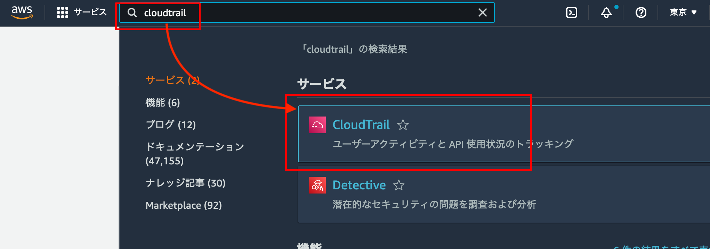

リージョンが東京であることを確認します。

左側にあるドロアーメニューをクリックし、メニューを展開します。

[**イベント履歴**] を表示をクリックします。

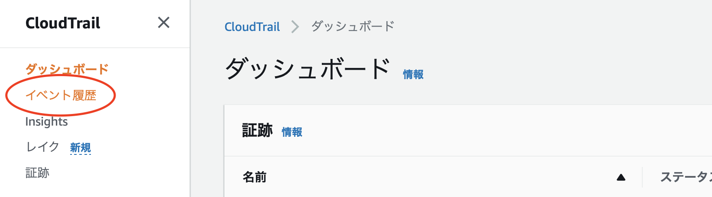

**＜注意＞**  

- アカウントで行われたアクションが履歴として記録され一覧に表示されます。
- 履歴は 90 日分まで保持することができます。
- 90 日分以上履歴を残したい場合は、以降の作業が必要です。

### 証跡の作成

CloudTrail のコンソールに記載されている [**証跡の作成**] ボタンをクリックします。

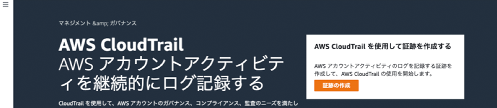

任意の証跡名を入力します。ここでは、management-events としています。  
[**新しい S3 バケットを作成します**] が選択されていることを確認します。  

**証跡ログバケットおよびフォルダ** は自動で入力されていますが、認識しやすいバケット名に変更もできます。

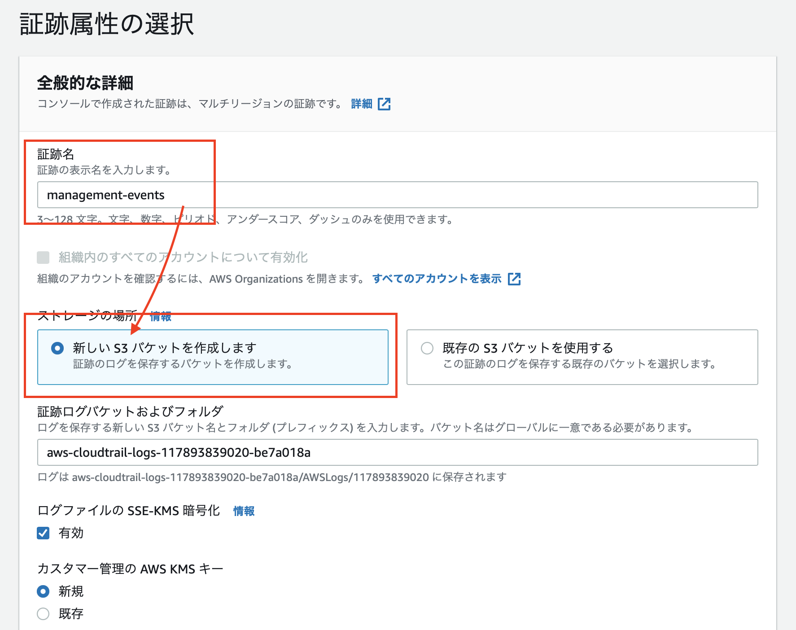

ページ下部にある [**次へ**] ボタンをクリックします。

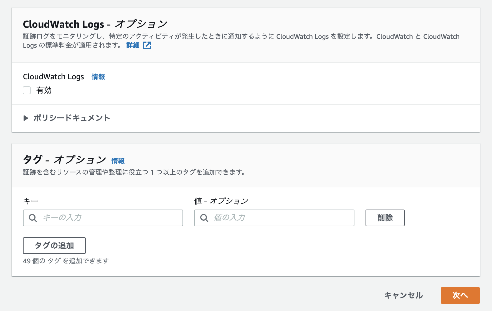

**ログイベントの選択** 画面に遷移しますので、何も変更せずに [**次へ**] ボタンをクリックします。　　

<aside class="positive">S3 のダウンロードやアップロードの証跡を残したい場合は、データイベントにチェックを入れて下部に表示されたオプションを選択します。</aside>

確認画面で [**証跡の作成**] ボタンをクリックすると S3 バケットに記録が保存されていきます。

## オプション 2 Budgets の設定

AWS Budgets を設定すると、AWS の予算設定ができます。  
例えば、事前に設定しておいた予算を超えと (あるいは超えそうになると) 通知したりできます。

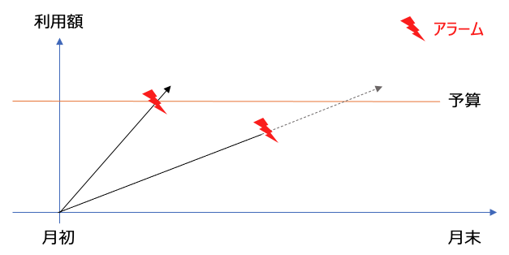

<aside class="negative">リアルタイムではなく、1 日単位での評価になるのでご注意ください。</aside>

<aside class="negative">Budgets は次に記載の設定をしないと IAM ユーザーがパスワードを変更できる権限から操作ができません。ルートユーザーにて実施をお願いします。</aside>

### IAM ユーザーが請求情報にアクセスできるようにするには？

<aside class="positive">ルートユーザーでログインしてください。ログイン方法は [4] サインイン をご確認ください。</aside>

右上のアカウント名をクリックして、[**アカウント**] を選択します。

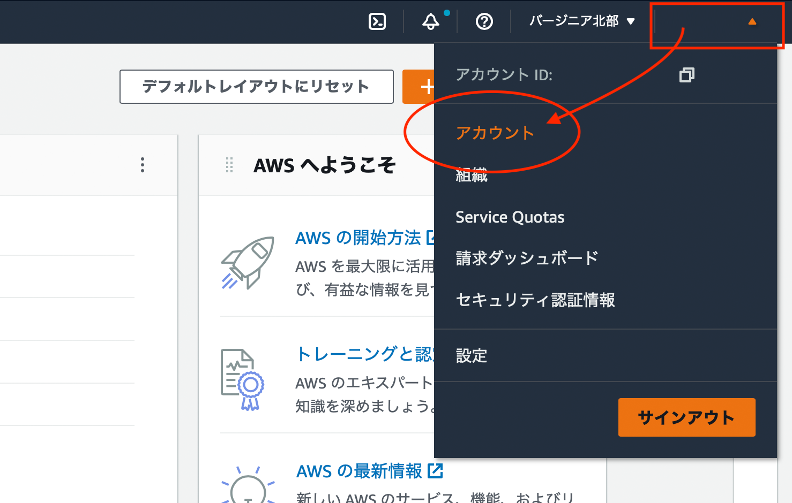

中断にある **IAM ユーザー/ロールによる請求情報へのアクセス** にある「**編集**」ボタンをクリックします。

**IAM アクセスのアクティブ化** のチェックボックスにチェックを入れます。

<aside class="positive">有効になっていると、以下の通り [IAM ユーザー/ロールによる請求情報へのアクセスは有効になっています。] が表示されます。</aside>

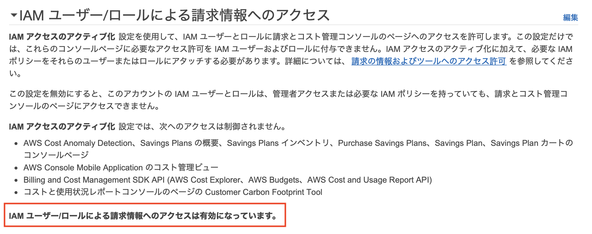

上記の設定を行なうと、IAM ユーザーに Billing / Budget 権限が有効になっている場合に請求情報へアクセスができます。

<aside class="positive">AdministratorAccess をアタッチしていると請求情報にアクセスできます。</aside>

### Budget 設定

左側のメニューにある Budget をクリックし、[**予算を作成する**] ボタンをクリックします。

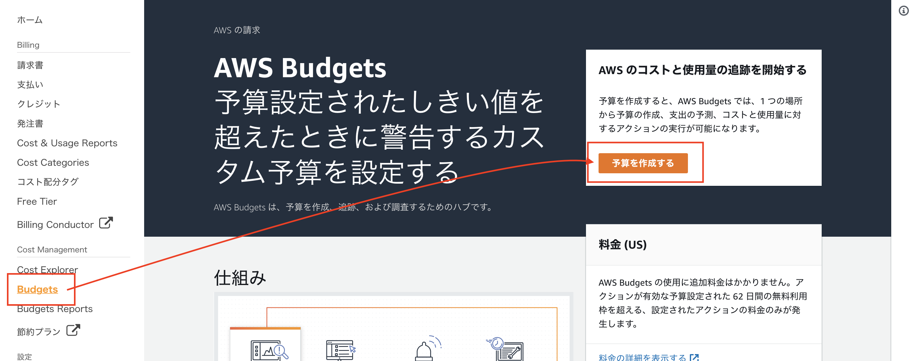

**予算タイプを選択** が表示されるので、**コスト予算 – 推奨** のまま、[**次へ**] ボタンをクリックします。

**詳細** にある予算名に任意の名前をつけます。ここでは $20 としています。

**予算額を設定** にある **予算額 ($) を設定してください** に 20.00 を設定します。

[**次へ**] ボタンをクリックします。

[**アラートのしきい値を追加**] ボタンをクリックしてください。

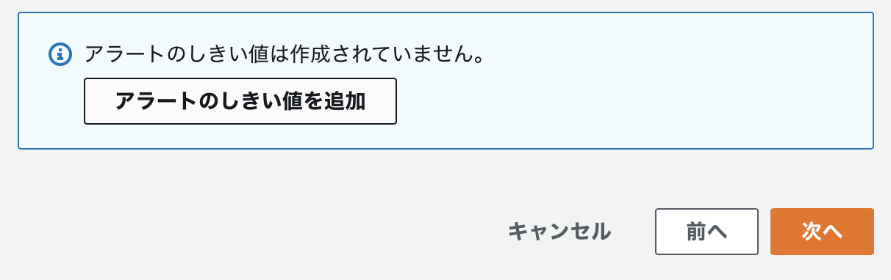

以下が展開するので、しきい値を 100 にし、通知する E メールを設定します。  
[**次へ**] ボタンをクリックします。

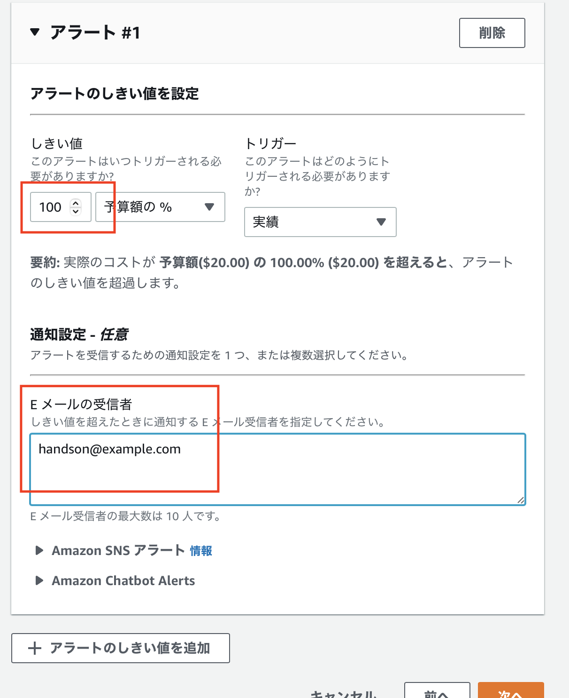

先ほどの **Alert#1** の画面に戻るので、[**次へ**] ボタンをクリックします。

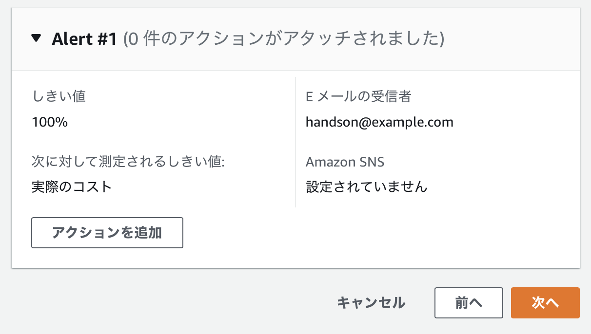

[**予算を作成**] ボタンをクリックします。

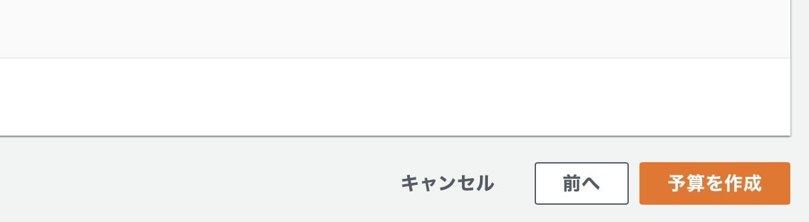

これで、$20 を超えた場合にアラート通知されるようになります。

## オプション 3 Cost Explorer の設定

AWS Cost Explorer は AWS 料金の使用金額を確認するためのサービスです。  
24 時間単位で、その日時点の料金が確定しますので今日のハンズオンが終わってから、明日、明後日に料金が発生していないか確認をしてください。

左側のメニューペインから **Cost Explorer** をクリックし、[**Cost Explorer を起動**] ボタンをクリックします。

しばらくすると以下の画面になりますので、[**Cost Exlorer で表示**] ボタンをクリックしてください。

[**自動選択:**] から、1 月間や、過去 6 ヶ月といった期間でコストの変動を確認できます。
また、[毎時、日別、月別] を選択してクローズアップした調査や、長期に渡っての確認が可能です。

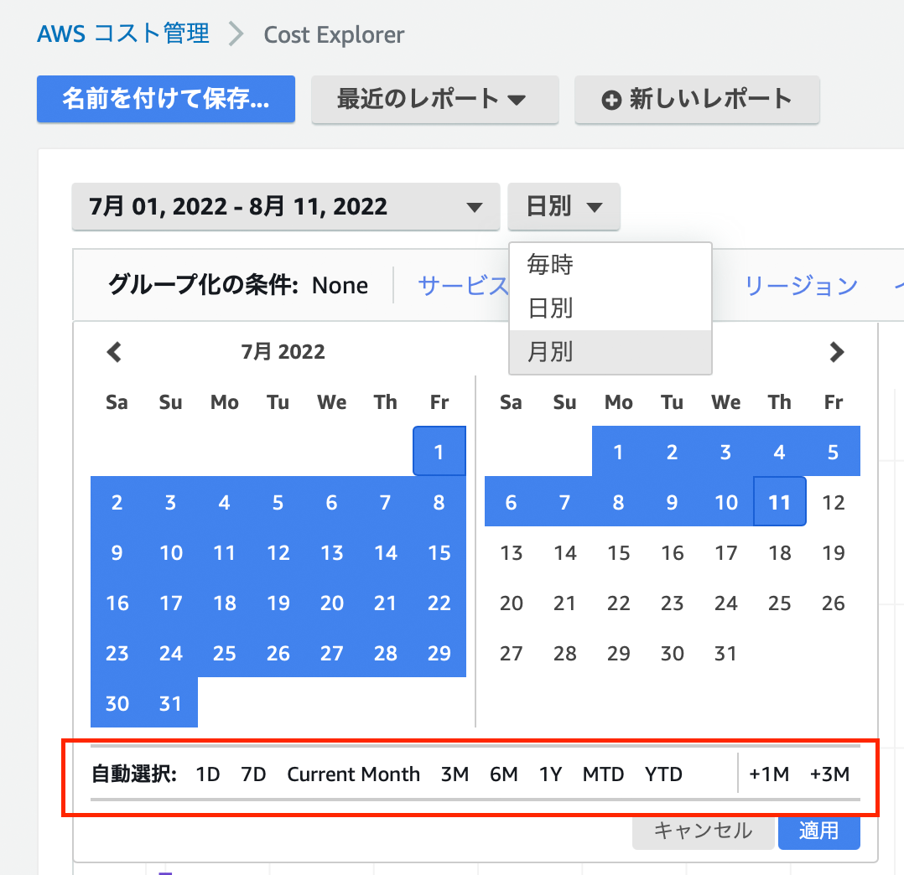

## その他 追加情報

1. MFA デバイスが故障または紛失した場合のセルフサービスによるリセットの方法  
  [https://aws.amazon.com/jp/blogs/news/how-to-reset-mfa-token/](https://aws.amazon.com/jp/blogs/news/how-to-reset-mfa-token/)

2. AWS SSO の MFA で Macbook の TouchID (指紋センサー) を使う方法  
 [https://dev.classmethod.jp/articles/multi-factor-authentication-with-webauthn-for-aws-sso/](https://dev.classmethod.jp/articles/multi-factor-authentication-with-webauthn-for-aws-sso/)