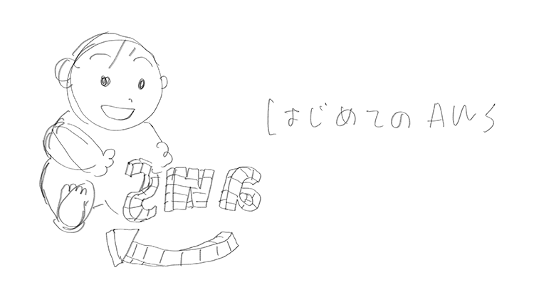

summary: AWSアカウントを作成してみよう～ Presented by JAWS-UG 初心者支部 2022
id: docs
categories: AWS, Acount, Registration
environments: Web
status: Draft
feedback link: https://github.com/otanikohei/How_to_Sign_up_AWS_Account/settings

# AWSアカウントを作成してみよう～ Presented by JAWS-UG 初心者支部 ２０２２

## はじめに
Duration: 0:05:00

本ハンズオンは以下のような方をターゲットにしています。

- AWS アカウントを契約して使いたいけど、具体的な手順が分からない
- 手順は知っているけど、操作方法が分からなくなったときに聴ける環境がないと不安
- 課金システムが分からない
- 高額請求が怖い

### 前提や注意点

<aside class="negative">アカウント作成の注意点についてはできる限り配慮していますが、保証・補償をする物ではございません。 </aside>

<aside class="negative">アカウント作成した後、運用次第では費用が発生する可能性があります。</aside>

### ご用意いただきたいもの

- メールアドレス
- クレジットカード／デビットカード
- SMS (ショートメッセージサービス) が届く携帯電話やスマートホンなどの機器
- Google Authenticator

#### Google Authenticator について

本ハンズオンでは、AWS アカウントの不正アクセスやアカウント乗っ取りなどの被害を防ぐため、**多要素認証（MFA）** を必須とさせていただいております。  

AWS アカウントを契約すると、登録したメールアドレスが **ルートユーザー** になります。  
ルートユーザーはアカウント内の全てのアクションを行うことができるので、

各自、App Store などで 「Google Authenticator」 で検索、ダウンロードをお願いします。

- Android の方：[Google Play](https://play.google.com/store/apps/details?id=com.google.android.apps.authenticator2&hl=ja&gl=US)  
- iPhone の方： [App Store](https://apps.apple.com/jp/app/google-authenticator/id388497605)

<aside class="negative">ハンズオン終了後も、Google Authenticator は削除しないでください！
AWS アカウントにログインができなくなります。 </aside>

<aside class="positive">Authy などでも対応可能ですが、本ハンズオンでは環境を統一するために Google Authenticator にてご案内します。</aside>

## AWS の無料利用枠について

AWS には無料利用枠があります。一部のサービスが一定額まで無料であったり、期間限定で無料で体験できます。

[https://aws.amazon.com/jp/free](https://aws.amazon.com/jp/free)

以下は、無料枠の一部ですが有効期限が 12 ヶ月のものが多いので使えるうちに色々試してしまいましょう！ 

## AWS アカウント作成の流れ

Amazon Web Service (AWS) を利用するには、AWS アカウントの契約が必要です。

以下リンクをクリックすると、AWS アカウントを作る方法が画面のスクリーンキャプチャー付きで紹介されています。  
まずは、この手順に沿ってアカウントを作成してください。

[https://aws.amazon.com/jp/register-flow/](https://aws.amazon.com/jp/register-flow/)

## サインイン

アカウントができたらサインインしてみましょう。  
以下 URL からサインインできます。

[https://signin.aws.amazon.com/console](https://signin.aws.amazon.com/console)

上記画面がサインイン画面が表示されたら、

「ルートユーザーの E メールを使用したサインイン」のリンクをクリックしてください。

上記画面に遷移しますので、[ **○ ルートユーザー** ] が選択されていることを確認し、メールアドレスを入力して、[ **次へ** ] をクリックしてください。

先ほど設定したパスワードでサインインしてください。

上記画面にサインインされたら、成功です。

他のハンズオンで「コンソール画面を開いて」と言われた場合は、この画面 またはこの画面から遷移する AWS サービスの画面を意味しています。

## セキュリティ強化

- アカウントの神様的存在であるルートユーザーを盗られると大変
- メールアドレス、パスワード以外にもログイン時に必要な情報を追加すべき

アカウント名をクリックして、[ **セキュリティ認証情報** ] をクリックします。

[ **多要素認証 (MDA)** ] にあります [ **MFA の有効化** ] ボタンをクリックしてください。

[ **仮想 MFA デバイス** ] が選択されていることを確認して、[ **続行** ] ボタンをクリックします。

[ **QA コードの表示** ] というリンクをクリックして、ください。QR コードが表示されますので、google Authenticator で読み込んでください。

Google Authenticator から発行されたコードを 2 つ入力して、[ **MFA の割り当て** ] ボタンをクリックしてください。

上記メッセージが表示されたら成功です。
