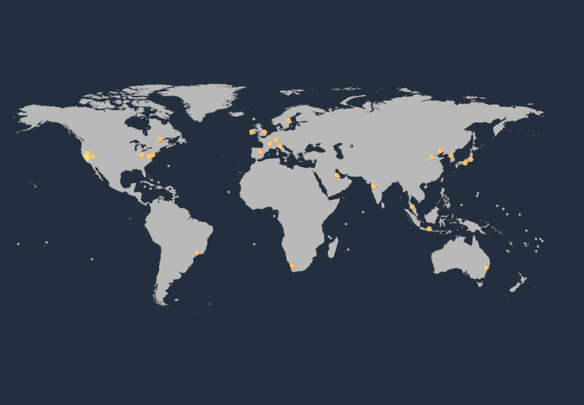
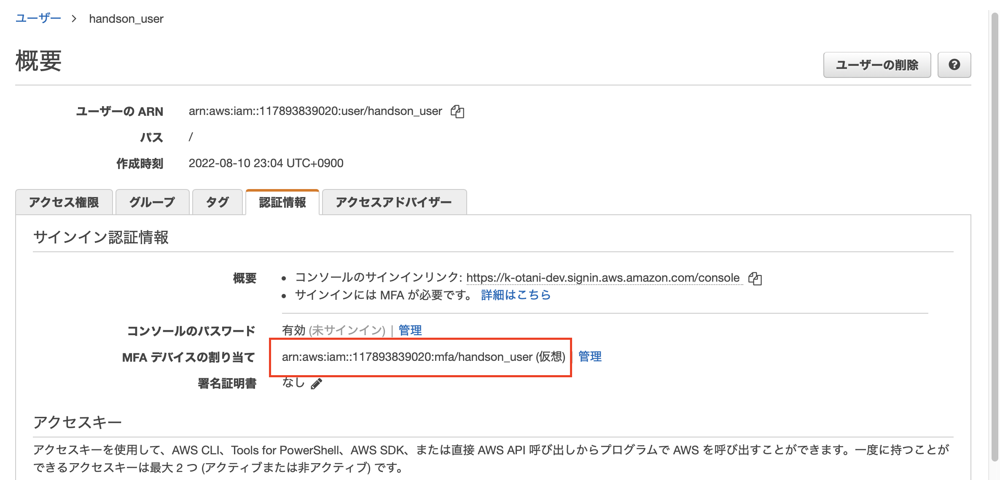

summary: AWSアカウントを作成してみよう～ Presented by JAWS-UG 初心者支部 2022
id: docs
categories: AWS, Acount, Registration
environments: Web
status: Draft
feedback link: https://github.com/otanikohei/How_to_Sign_up_AWS_Account/settings

# AWSアカウントを作成してみよう～ Presented by JAWS-UG 初心者支部 ２０２２

## はじめに
Duration: 0:05:00


本ハンズオンは以下のような方をターゲットにしています。

- AWS アカウントを契約して使いたいけど、具体的な手順や詳細が分からない
- 手順は知っているけど、操作方法が分からなくなったときに質問できないのは不安
- 課金システムが分からない、高額請求が怖い

### 前提や注意点

<aside class="negative">アカウント作成の注意点についてはできる限り配慮していますが、保証・補償をする物ではございません。 </aside>

<aside class="negative">アカウント作成した後、運用次第では費用が発生する可能性があります。</aside>

### ご用意いただきたいもの


- メールアドレス
- クレジットカード／デビットカード
- SMS (ショートメッセージサービス) が届く携帯電話やスマートホンなどの機器
- Google Authenticator

## AWS の無料利用枠について

AWS には無料利用枠があります。一部のサービスが一定額まで無料であったり、期間限定で無料で体験できます。

[https://aws.amazon.com/jp/free](https://aws.amazon.com/jp/free)

以下は、無料枠の一部ですが有効期限が 12 ヶ月のものが多いので使えるうちに色々試してしまいましょう！ 


## AWS アカウント作成の流れ

Amazon Web Services (AWS) を利用するには、AWS アカウントの契約が必要です。

以下リンクをクリックすると、AWS アカウントを作る方法が画面のスクリーンキャプチャー付きで紹介されています。  
まずは、この手順に沿ってアカウントを作成してください。

[https://aws.amazon.com/jp/register-flow/](https://aws.amazon.com/jp/register-flow/)

## サインイン

アカウントができたらサインインしてみましょう。  
以下 URL からサインインできます。

[https://signin.aws.amazon.com/console](https://signin.aws.amazon.com/console)

以下の画面がサインイン画面が表示されたら、


「ルートユーザーの E メールを使用したサインイン」のリンクをクリックしてください。


以下の画面に遷移しますので、[ **○ ルートユーザー** ] が選択されていることを確認し、**ルートユーザーの E メールアドレス** にメールアドレスを入力して、[ **次へ** ] ボタンをクリックしてください。


パスワードを入力する画面に遷移しますので、先ほどの **アカウント作成手順** にて設定したパスワードでサインインしてください。


以下の画面が表示されたらサインイン成功です。


今後、他のハンズオンで「コンソール画面を開いて」と言われた場合は、この画面、またはこの画面から遷移する AWS サービスの画面のことだ、とご認識ください。

## マネジメントコンソールの構成

マネジメントコンソールの画面の構成について簡単に説明します。  


1. 左上の AWS のロゴをクリックすると、トップページが表示されます。  
  
2. サービスをクリックすると、サービスの一覧が表示されます。  
  
3. テキストボックスにキーワードを入力すると候補が表示されます。例えば、api と入力すると、API Gateway が一番に表示され、次候補に API を記録する CloudTrail が表示されます。
  
4. CloudShell のアイコンです。本ハンズオンでは取り上げませんが、AWS CLI を実行できます。
  
5. パーソナルヘルスダッシュボードです。メンテナンスのお知らせや障害などが通知されます。
  
6. サポートセンター へのリンクや、AWS IQ というエキスパートとコンタクトを取るためのツール、re:Post というフォーラムなどにアクセスができます。
  
7. アカウント名をクリックすると、請求情報やセキュリティ情報、アカウント情報にアクセスできます。
  

<aside class="positive">アカウント 名をクリックすると、12 桁のアカウント ID が表示されますので、控えておいてください。後ほど使用します。</aside>

### リージョンとアベイラビリティゾーン (AZ)

AWS クラウドは、2022年8月現在、全世界 26 の地域にある 84 のアベイラビリティーゾーンにまたがっており、24 アベイラビリティーゾーンと 8 AWS リージョンを追加する計画が発表されています。

AWS のリージョンは必ず複数のデータセンタークラスタ（=AZ）で構成されています。 各 AZ 間は数十キロ離れ、電源やネットワークが独立しており、高い耐障害性を提供できる設計になっています。

[AWS グローバルインフラストラクチャマップ](https://aws.amazon.com/jp/about-aws/global-infrastructure/)



#### リージョンを変更する (シンガポール)

AWS マネジメントコンソールに初めてサインインすると、「**バージニア北部**」リージョンが表示されます。練習で、シンガポールリージョンに移動してみたいと思います。

このリージョン名をクリックして候補から、[ **アジアパシフィック (シンガポール) ap-southeast-1** ] を選択してください。


#### リージョンを変更する (シドニー)

画面遷移して「シンガポール」リージョンが表示されたら、次は「シドニー」リージョンに移動してみてください。**シンガポール** をクリックし、[ **アジアパシフィック (シドニー) ap-southeast-2** ] を選択してください。


#### リージョンを変更する (東京)

リージョンの移動は完璧でしょうか。

それでは、本日構築する「東京」リージョンに移動してください。「シドニー」をクリックし、[ **アジアパシフィック (東京) ap-northeast-1** ] を選択してください。


#### デフォルトリージョンを設定する

AWS マネジメントコンソールは「最後に利用したリージョン」を表示するようになっています。

これを変更するには、[設定] を開き、デフォルトリージョン の「最後に使用したリージョン」から希望のリージョンに変更してください。


### リージョンのオプトイン方法

香港以降のリージョンは、デフォルトで無効になっておりアカウントから有効 (オプトイン) にする必要があります。

右上のアカウント名をクリックして、**アカウント** を選択します。


遷移したページの中断に表示される AWS リージョンで無効のものが有効に変更できます。


<aside class="position">デフォルトで 有効 になっているリージョンは有効にしたり無効にしたり変更ができません。</aside>

アクションのカラムにある **有効化** をクリックして、


メッセージを確認して、[ **リージョンを有効化** ] ボタンをクリックすると有効になります。


逆に無効にする場合は、**無効化** をクリックして、


「**無効化**」と入力して、ボタンをクリックすれば無効化できます。


## セキュリティ強化 - MFA

AWS アカウントを契約した際のメールアドレスが、**ルートアカウント** になります。  
ルートユーザーはアカウント内の全てのアクションを行うことができるので、アカウント内の神様とも言える権限があります。  


本ハンズオンでは、AWS アカウントの不正アクセスやアカウント乗っ取りなどの被害を防ぐため、**多要素認証（MFA）** を必須とさせていただいております。  

ユーザー名とパスワードに加えて、一時的な認証コードである MFA を合わせることでセキュリティを大幅に強化できます。


iPhone をご利用の方は App Store で、Android をご利用の方は Google Play で「Google Authenticator」と検索してインストールしてください。

#### Google Authenticator


- Android の方：[Google Play](https://play.google.com/store/apps/details?id=com.google.android.apps.authenticator2&hl=ja&gl=US)  
- iPhone の方： [App Store](https://apps.apple.com/jp/app/google-authenticator/id388497605)

<aside class="negative">ハンズオン終了後も、Google Authenticator は削除しないでください！
AWS アカウントにログインができなくなります。 </aside>

<aside class="positive">多要素認証 は Microsoft Authenticator や Authy などでも対応可能ですが、本ハンズオンでは環境を統一するために Google Authenticator にてご案内します。</aside>

### 多要素認証の設定

まとめますと、多要素認証は以下のために設定をします。

- アカウントの神様的権限を持つルートユーザーを盗られると大変
- メールアドレス、パスワード以外にもログイン時に必要な情報を追加すべき

AWS マネジメントコンソールを操作して、多要素認証を設定していきます。  
画面の右上にあるアカウント名をクリックして、[ **セキュリティ認証情報** ] をクリックします。


**セキュリティ認証情報** の画面に遷移するので、[ **多要素認証 (MFA)** ] にあります [ **MFA の有効化** ] ボタンをクリックしてください。


**MFA デバイスの管理** のダイヤログ画面が表示されるので、**○ 仮想 MFA デバイス** が選択されていることを確認して、[ **続行** ] ボタンをクリックします。


**MFA デバイスの設定** の画面に遷移するので、[ **QA コードの表示** ] というリンクをクリックしてください。  
QR コードが表示されます。


お手元のスマホで Google Authenticator アプリを開き QR コードを読み込んでください。  
右下の [+] アイコンをタップして、


[QR コードをスキャン] をタップして、


スマホをパソコンの画面に表示されている QR コードに近づけて読み込んでください。ちょうど四角の部分に合わせるように読み込みます。


QR コードを読み込むと、コードが表示されます。  
Google Authenticator から発行されたコードを 2 つ入力して、[ **MFA の割り当て** ] ボタンをクリックしてください。  
まず、表示されたコードを **MFA コード1** に入力してください。  
一定時間が過ぎると別の MFA コードが表示されるので **MFA コード2** に入力してください。

<aside class="positive">連続した 2 つのコードを入力する必要があります。コードが切り替わったタイミングで入力を始めるとスムーズに進めることができます。</aside>


以下のメッセージが表示されたら成功です。


## セキュリティ強化 - IAM ユーザー

### ユーザーを追加しましょう


先ほど MFA を設定したルートユーザーはアカウントの神様的存在ですので、普段は使わないことがベストプラクティスとして推奨されています。  
普段使うユーザーは IAM というサービスから作成できます。

IAM ユーザーも漏洩して不正利用されると権限によっては大きな被害を受けますので、MFA を設定してください。  

### AWS IAM とは


AWS Identity and Access Management (IAM) は、誰がどのサービスやリソースに、どのような条件でアクセスできるかを指定することができる権限コントロールのためのサービスです。  
誰がどのような操作を行ったか証跡を取ることにも貢献します。

IAM には、大きく分けて 4 つの機能があります。

#### **ユーザーグループ**

ユーザーをとりまとめるための機能です。  
会社で例えると、部、課、チームのような概念です。

#### **ユーザー**

AWS を利用するユーザーを管理するための機能です。  
アプリケーションに操作を委ねるアクセスキーも発行できます。  
会社で例えるなら社員や社員証といったところです。

#### **ロール**

サーバーやプログラムに割り当てる権限情報です。  
会社で例えると、ID カードのようなものでしょうか。

#### **ポリシー**

上記、グループ、ユーザー、ロールに付与する具体的な権限の内訳です。  
操作を許可したり、禁止したりできます。  

#### **関係性**


1. ポリシー A はユーザー A にのみ適用されます。
2. ポリシー B、C、D は、ユーザー A とユーザー B が含まれるグループに適用されます。
3. ポリシー E は、ロールにアタッチして、EC2 インスタンスにアタッチするとインスタンスにポリシー E の権限が付与できます。

### IAM ユーザーを作成する

それでは、Administrator の権限を持つ IAM ユーザーを作成してみましょう。

IAM コンソールにアクセスしてください。  
検索ボックスに「iam」と入力して、候補をクリックするか、以下の URL をクリックして、CloudTrail コンソールにアクセスします。

[https://us-east-1.console.aws.amazon.com/iamv2/home](https://us-east-1.console.aws.amazon.com/iamv2/home)


IAM コンソールに画面が遷移したら、左側のメニューペインから **ユーザー** をクリックします。


**ユーザー** の画面に遷移するので、[ **ユーザーを追加** ] ボタンをクリックします。


ユーザー名は任意です。  
以下のような例に従って、ユーザーを作成してください。

**例1:** handson_user  
**例2:** YamadaTaro

**パスワード - AWS マネジメントコンソールへのアクセス** のチェックボックスにチェックを入れてください。  
チェックを入れると、下部に **コンソールのパスワード** などが動的に表示されますが、変更せずに [ **次のステップ: アクセス権限** ] ボタンをクリックしてください。  


**アクセス許可の設定** に画面が遷移するので、[ **既存のポリシーを直接アタッチ** ] を選択し、検索ボックスに「AdministratorAccess」と入力します。  
[ **ENTER** ] キーを押下すると、候補に「AdministratorAccess」が表示されるので、チェックボックスにチェックを入れて、
[ **次のステップ: タグ** ] ボタンをクリックしてください。


**タグの追加 (オプション)** に画面遷移するので何も入力せずに、[ **次のステップ: 確認** ] ボタンをクリックします。  
**確認** 画面に遷移するので、内容に不備がないか確認して [ **ユーザーの作成** ] ボタンをクリックします。

<aside class="positive">AdministratorAccess とは別に、IAMUserChangePassword が付与されています。IAMUserChangePassword は IAM ユーザーがパスワードを変更できる権限です。IAM ユーザー作成時に標準で授与されます。</aside>


ここで、必ず [ **.csv のダウンロード** ] ボタンをクリックして、認証情報をダウンロードしておいてください。  
これがないと、ログインパスワードが分かりません。  

ダウンロードができたら、[ **閉じる** ] ボタンをクリックします。


作成したユーザー名をクリックしてください。


### MFA を有効化する

ルートユーザー同様、作成したユーザーも乗っ取られると大変なことになります。  
そのため、MFA を有効にしておきます。

[ **認証情報** ] タブを選択して、**MFA デバイスの割り当て** にある **管理** をクリックします。


**MFA デバイスの管理** のダイヤログ画面が表示されるので、[ **仮想 MFA デバイス** ] が選択されていることを確認して、[ **続行** ] ボタンをクリックします。


Google Authenticator アプリを開き、で読み込んでください。右下の [+] アイコンをタップして、


Google Authenticator から発行されたコードを 2 つ入力して、[ **MFA の割り当て** ] ボタンをクリックしてください。  


以下のメッセージが表示されたら成功です。


MFA を有効化すると、以下のように MFA デバイスの割り当てが **なし** からリソース情報 (ARN といいます) に変わります。



<aside class="positive">作成したユーザーはユーザー一覧のページから確認できます。</aside>

ユーザー一覧のページ
[https://us-east-1.console.aws.amazon.com/iamv2/home#/users](https://us-east-1.console.aws.amazon.com/iamv2/home#/users)

## アカウントの確認とサインアウト

### AWS アカウントの確認

AWS アカウントは、数字 12 桁の数字で表現されます。  
画面上部でマイアカウントをクリックすると、確認できます。  

次作業で必要ですので、メモをしておいてください。

### サインアウト

AWS マネジメントコンソールでの操作を終えたらサインアウトをします。
画面上部をクリックして、サインアウトを選択します。

## IAM ユーザーでサインインする

作成した IAM ユーザーでサインインしてみましょう。

以下 URL にアクセスするか、表示されているようであれば [もう一度ログインする] ボタンをクリックしてください。

[https://signin.aws.amazon.com/console](https://signin.aws.amazon.com/console)

以下の画面に遷移しますので、[ **○ IAM ユーザー** ] が選択されていることを確認し、**アカウント ID (12 桁)　またはアカウントエイリアス** にアカウント ID を入力して、[ **次へ** ] ボタンをクリックしてください。

<aside class="positive">アカウント ID を控えるのを忘れた方は届いたメールを確認するか、ルートアカウントでサインインして確認してください。初回はパスワード変更が求められるので、新しいパスワードを設定してください。</aside>


アカウント ID、ユーザー名、パスワードを入力する画面に遷移しますので、それぞれを入力してサインインしてください。


<aside class="positive">ユーザー名とパスワードは先ほどのIAM ユーザーを作成する手順でダウンロードした csv ファイルに記載されています。</aside>

以下の画面が表示されたらサインイン成功です。


## オプション 1 AWS CloudTrail


### CloudTrail の仕組み

AWS の各種サービスは「マネージメントコンソール」、「AWS CLI」、「SDK」、「他AWSサービス」から操作ができますが、ほとんどは API エンドポイントへアクセスします。


CloudTrail はこの AWS アカウント内で実行された API アクションを記録するサービスです。
例えば EC2 インスタンスを削除した場合だと以下などが把握できます。

- **Who?**  
  誰が EC2 インスタンスを削除したか追跡できます。
- **What?**  
  何台の EC2 インスタンス削除したか追跡できます。
- **Where？**  
  どこから削除の API が発信されたか？追跡できます。
- **When？**  
  いつ削除の API が送信されたか？追跡できます。

CloudTrail は有事の際に障害切り分けに利用できたり、不正アクセスかどうか判断する材料になったりと大変有効なサービスです。

### 無料枠で取得できないアクティビティ

すべての管理イベント、データイベント、読み込み専用アクティビティを含むアカウントアクティビティの完全なレコードは CloudTrail の証跡を設定しなければ取得できません。

### CloudTrail の料金

CloudTrail はアカウントを作成した直後から有効になります。
証跡の取得自体は料金がかかりませんが、ログを S3 バケットに出力するため S3 バケットの料金がかかります。

詳細は以下サイトに記載されています。

[https://aws.amazon.com/jp/cloudtrail/pricing/](https://aws.amazon.com/jp/cloudtrail/pricing/)

### 設定方法

検索ボックスに「cloudtrail」と入力して、候補をクリックするか、以下の URL をクリックして、CloudTrail コンソールにアクセスします。

[https://ap-northeast-1.console.aws.amazon.com/cloudtrail/home?region=ap-northeast-1](https://ap-northeast-1.console.aws.amazon.com/cloudtrail/home?region=ap-northeast-1)


リージョンが東京であることを確認します。


左側にあるドロアーメニューをクリックし、メニューを展開します。


[ **イベント履歴** ] を表示をクリックします。


**＜注意＞**  

- アカウントで行われたアクションが履歴として記録され一覧に表示されます。
- 履歴は 90 日分まで保持することができます。
- 90 日分以上履歴を残したい場合は、以降の作業が必要です。

### 証跡の作成

CloudTrail の左側にあるドロアーメニューをクリックし、メニューを展開します。


メニューにある **証跡** のリンクをクリックして、表示された [ **証跡の作成** ] ボタンをクリックします。


任意の証跡名を入力します。ここでは、management-events としています。  
[ **新しい S3 バケットを作成します** ] が選択されていることを確認します。  


<aside class="positive"> Amazon S3 は定価コストで大量のデータを保存するのに適した AWS のオブジェクトストレージです。</aside>

**証跡ログバケットおよびフォルダ** は自動で入力されていますが、認識しやすいバケット名に変更もできます。

<aside class="positive"> 後ほど、Athena の手順で使用するので、S3 バケット名を控えておいてください。</aside>

<aside class="positive"> ログファイルの SSE-KMS 暗号化のチェックボックスのチェックは、このハンズオンでは外しておいてください。</aside>


ページ下部にある [ **次へ** ] ボタンをクリックします。


**ログイベントの選択** 画面に遷移しますので、何も変更せずに [ **次へ** ] ボタンをクリックします。　　

<aside class="positive">S3 のダウンロードやアップロードの証跡を残したい場合は、データイベントにチェックを入れて下部に表示されたオプションを選択します。</aside>

確認画面で [ **証跡の作成** ] ボタンをクリックすると S3 バケットに記録が保存されていきます。

## オプション 2 Budgets の設定


AWS Budgets を設定すると、AWS の予算設定ができます。  
例えば、事前に設定しておいた予算を超えると (あるいは超えそうになると) 通知したりできます。


<aside class="negative">リアルタイムではなく、1 日単位での評価になるのでご注意ください。</aside>

<aside class="negative">Budgets は次に記載の設定をしないと IAM ユーザーがパスワードを変更できる権限から操作ができません。ルートユーザーにて実施をお願いします。</aside>

### IAM ユーザーが請求情報にアクセスできるようにするには？

<aside class="positive">ルートユーザーでログインしてください。ログイン方法は [4] サインイン をご確認ください。</aside>

右上のアカウント名をクリックして、[ **アカウント** ] を選択します。


ページ中段にある **IAM ユーザー/ロールによる請求情報へのアクセス** にある「**編集**」ボタンをクリックします。


**IAM アクセスのアクティブ化** のチェックボックスにチェックを入れます。


<aside class="positive">有効になっていると、以下の通り [IAM ユーザー/ロールによる請求情報へのアクセスは有効になっています。] が表示されます。</aside>


上記の設定を行なうと、IAM ユーザーに Billing / Budget 権限が有効になっている場合に請求情報へアクセスができます。

<aside class="positive">AdministratorAccess をアタッチしていると請求情報にアクセスできます。</aside>

### Budget 設定

左側のメニューにある Budget をクリックし、[ **予算を作成する** ] ボタンをクリックします。


**予算タイプを選択** が表示されるので、**コスト予算 – 推奨** のまま、[ **次へ** ] ボタンをクリックします。


**詳細** にある予算名に任意の名前をつけます。ここでは $20 としています。


**予算額を設定** にある **予算額 ($) を設定してください** に 20.00 を設定します。


その下に表示されている **予算の範囲** はデフォルトのままで OK です。


[ **次へ** ] ボタンをクリックします。


[ **アラートのしきい値を追加** ] ボタンをクリックしてください。


以下が展開するので、しきい値を 100 にし、通知する E メールを設定します。  
[ **次へ** ] ボタンをクリックします。


先ほどの **Alert#1** の画面に戻るので、[ **次へ** ] ボタンをクリックします。


[ **予算を作成** ] ボタンをクリックします。


これで、$20 を超えた場合にアラート通知されるようになります。

## オプション 3 Cost Explorer の設定


AWS Cost Explorer は AWS 料金の使用金額を確認するためのサービスです。  
24 時間単位で、その日時点の料金が確定しますので今日のハンズオンが終わってから、明日、明後日に料金が発生していないか確認をしてください。

左側のメニューペインから **Cost Explorer** をクリックし、[ **Cost Explorer を起動** ] ボタンをクリックします。


しばらくすると以下の画面になりますので、[ **Cost Exlorer で表示** ] ボタンをクリックしてください。


[ **自動選択:** ] から、1 月間や、過去 6 ヶ月といった期間でコストの変動を確認できます。
また、[毎時、日別、月別] を選択してクローズアップした調査や、長期に渡っての確認が可能です。


## オプション 4 サインインアラート の設定

AWS CloudTrail と Amazon Event Bridge、Amazon Simple Notification Service を **連携** して利用することで、AWS マネジメントコンソールにサインインしたタイミングで通知することができます。  
アカウント情報の漏洩を素早く検知できると、不正利用や身に覚えのない高額請求を防ぐことができます。

ここでは、AWS マネジメントコンソールにサインインするとメール通知する仕組みを導入します。

### 座学

「**連携**」部分をご説明します。  
まず、ユーザーがサインインすると、裏側で「**サインインの API コール**」が発生します。  
そして、API のイベント履歴が CloudTrail に記録されます。  
EventBridge は、CloudTrail のサインインイベントをトリガーに SNS トピックを立てることができます。  
SNS トピックは、メールや Slack、アプリケーションを組めば Twitter などさまざまな形式でサブスクライブ (購読) できます。  

上記のサービスがピタゴラスイッチのように組み合わさった結果、サインインするとメール通知される仕組みができます。


### Amazon SNS トピックを設定する


メールの通知には SNS トピックが必要です。  
EventBridge を設定する前に、SNS トピックを設定します。  

検索ボックスに SNS と入力して **Amazon Simple Notification Service** を選択するか、[こちらの URL](https://us-east-1.console.aws.amazon.com/sns/v3/home) にアクセスして、SNS コンソールを開きます。


**バージニア北部リージョン** であることを確認して、異なる場合は移動してください。

<aside class="positive">サインイン情報はリージョンごとに記録されます。本手順はリージョンごとに設定が必要です。</aside>


ウェルカム画面が表示されたら、**トピック名** に任意のトピック名を入力して、[ **次のステップ** ] をクリックします。  
ここでは、**signin-topic** にしました。  


<aside class="positive">過去にトピックを作成したことがある方は、トピック から [ トピックの作成 ] ボタンをクリックして進めてください。</aside>

**トピックの作成** に画面遷移するので、**タイプ** を **スタンダード** にして、**名前** に任意のトピック名が入力されているか確認します。  
ここでは、**signin-topic** にしています。  


ページ下部の [ **トピックの作成** ] ボタンをクリックします。


### トピックをサブスクライブする

作成したトピックをサブスクライブすることで、メール通知を受けることができます。

左側のメニューから **サブスクリプション** をクリックして、[ **サブスクリプションの作成** ] ボタンをクリックします。


**トピック ARN** で先ほど作成したトピックを選択します。  
**プロトコル** は **E メール** を選択します。  
**エンドポイント** はご利用のメールアドレスを入力します。  
ページ下部の [ **サブスクリプションの作成** ] ボタンをクリックします。


以下のようなメールが届きますので、**Confirm subscription** のリンクをクリックします。


以下、Subscription Confirmed! が表示されたら成功です。


### Amazon EventBridge の設定

SNS の設定ができたら、EventBridge でサインインイベントのトリガーを作成していきます。


検索ボックスに EventBridge と入力するか、[こちらの URL](https://us-east-1.console.aws.amazon.com/events/home?region=us-east-1#/) にアクセスして、EventBridge コンソールを開きます。


**東京** リージョンであることを確認してください。

<aside class="positive">サインイン情報はリージョンごとに記録されます。</aside>


[**ルールを作成**] ボタンをクリックして、


任意の名前を入力します。ここでは、**signin-alarm** としています。  
[ **次へ** ] をクリックします。


ページが遷移したら、下部にある **イベントパターン** まで進み、**AWS のサービス** で [ **AWS コンソールのサインイン** ] を選択します。  
**イベントタイプ** が動的に表示されるので、**サインインイベント** を選択し、**任意のユーザー** にします。  
[ **次へ** ] ボタンをクリックします。


**ターゲットを選択** の画面に遷移するので、[ **○ AWS のサービス** ] が選択されていることを確認して、**ターゲットを選択** から [ **SNS トピック** ] を選択し、**トピック** は先ほど作成した SNS トピック名を選択します。ここでは「**singin-topic**」を選択します。  
[ **次へ** ] ボタンをクリックします。


**タグを設定 - オプション** の画面に遷移しますので、[ **次へ** ] ボタンをクリックします。  
**レビューと作成** 画面に遷移しますので、内容を確認して下部の [ **ルールの作成** ] ボタンをクリックします。

サインインすると以下のようなメール通知が届きます。


## CloudTrail を Athena で検索する


オプション 1 で AWS CloudTrail に証跡を設定すると、S3 バケットにログが出力されていきます。  
ただ、S3 バケットに保存されたファイルは .gz ファイルに圧縮されており、


ファイルには、以下のように JSON 形式で記録されています。  
これらのファイルを一つ一つダウンロードして確認するのは効率が悪いです。

```json
{
    "Records": [
        {
            "eventVersion": "1.08",
            "userIdentity": {
                "type": "AWSService",
                "invokedBy": "cloudtrail.amazonaws.com"
            },
            "eventTime": "2022-07-31T23:58:42Z",
            "eventSource": "s3.amazonaws.com",
            "eventName": "GetBucketAcl",
            "awsRegion": "ap-northeast-1",
            "sourceIPAddress": "cloudtrail.amazonaws.com",
            "userAgent": "cloudtrail.amazonaws.com",
(以下省略)
```

そこで、Amazon Ahena を利用して s3 バケットに複数のファイルとして保存されたログをまとめて横串で検索する方法をご紹介します。


Amazon Athena は S3 バケットに保存されたデータに対して、直接クエリを実行してデータを抽出できるサービスです。  
クエリ結果は結果用の S3 バケットに保存されます。まずは、Athena を実行するために、結果保存用バケットを設定します。

### Athena のクエリ結果を保存するバケットを作成

検索ボックスにて s3 と入力して、S3 をクリックするか、[こちら](https://s3.console.aws.amazon.com/s3/home?region=ap-northeast-1) をクリックして、Amazon S3 コンソールを開きます。


[ **バケットを作成** ] ボタンをクリックします。


**バケットを作成** 画面に遷移するので、任意のバケット名を入力します。  
ここでは、handson-athena-result-20220814 を指定しましたが、handson-athena-result-＜お名前＞ をお勧めします。


バケット名が入力できたら、画面下部の [ **バケットを作成** ] ボタンをクリックします。


CloudTrail を開き、左側のメニューから **イベント履歴** をクリックします。  
右側にある [ **Athena テーブルを作成** ] ボタンをクリックします。


すると、**Amazon Athena でテーブルを作成** 画面に遷移します。  
**ストレージの場所** は、先の手順で設定した証跡用のバケットを指定します。  
[ **テーブルを作成** ] ボタンをクリックします。


検索ボックスに athena と入力すると、候補に **Athena** が表示されるので、選択するか [こちら](https://ap-northeast-1.console.aws.amazon.com/athena/home?region=ap-northeast-1#/) をクリックして、Athena コンソールにアクセスします。  


左側のメニューから **クエリエディタ** をクリックすると、先ほどの CloudTrail での操作でテーブルが作成されているのが確認できます。  
Athena の検索結果を s3 バケットに保存できないと Athena はクエリを実行できませんので、


表示されているメッセージにある [ **設定を表示** ] ボタンをクリックします。  
メッセージが表示されない方は [ **設定** ] タブをクリックします。


[ **管理** ] ボタンをクリックして、


クエリ結果の場所に先ほど作成した s3 バケットを指定します。  
[ **保存** ] ボタンをクリックします。


設定できると以下のようにバケットのパスが設定されます。


Athena を実行する準備が整いましたので、試しに以下 SQL 文をコピペして実行してみてください。

<aside class="positive">FROM 句にある <テーブルとビューのテーブルに表示されているテーブル名> を書き換えてから実行してください。</aside>

```sql
SELECT
 useridentity.arn,
 eventname,
 sourceipaddress,
 eventtime
FROM <テーブルとビューのテーブルに表示されているテーブル名>
LIMIT 100;
```

[ **実行** ] ボタンをクリックして以下のように結果が表示されれば成功です。


各カラムの意味は以下の通りです。

|項目名|説明|
|---|---|
|arn|Amazon Resource Name (リソース名)|
|eventname|イベント名|
|sourceipaddress|実行元の IP アドレス|
|eventtime|イベントの日時|

## あと片付け
本手順で行った作業はアカウントを利用する上で、設定しておくべき事項ばかりですので削除は任意です。  
ここでは、Athena の結果用に作成した S3 バケットと、サインインアラートの削除情報をご紹介しておきます。

### Athena 用の S3 バケットを削除する

先の手順にて、Amazon Athena で実行したクエリの結果を保存するために S3 バケットを作成して設定しました。  
このバケットを削除するのですが、その前にまず Athena コンソールからテーブルを削除したり、設定からバケットを解除したりしていきます。

[こちら](https://ap-northeast-1.console.aws.amazon.com/athena/home?region=ap-northeast-1#/query-editor) から Athena コンソールを開き、左側のメニューペインから、クエリエディタをクリックして、[ **エディタ** ]タブを選択します。


開いているクエリをクエリ名の右側にある [x] アイコンをクリックして閉じます。  


確認メッセージが表示されるので、[ **クエリを閉じる** ] ボタンをクリックして閉じます。


テーブル名の右側にあるオプションボタン (縦に 3 つ ・・・ と並んでいるアイコンです) をクリックして、**テーブルを削除** を選択してください。


確認画面が表示されるので、テーブル名を入力して、[ **削除する** ] ボタンをクリックします。


次に [ **設定** ] タブをクリックします。


もし先に S3 バケットを削除した方は、以下のようなメッセージが表示されます。  
気にせずに S3 バケット名の右側にある [x] アイコンをクリックして、バケットの紐付けを解除し、[ **保存** ] ボタンをクリックしてください。

<aside class="negative">選択されたバケットが現在のリージョンに属しているかどうか確認できません。</aside>


s3 バケットの設定を解除すると、以下のメッセージが表示されて Athena が操作できなくなるため、本手順の順番で進めていただくとスムーズです。


#### s3 バケットを削除します。  

[こちら](https://s3.console.aws.amazon.com/s3/buckets?region=ap-northeast-1) から S3 コンソールにアクセスして、該当のバケットを選択します。

先の手順で作成した **handson-athena-result-＜お名前＞** のバケットを選択し、[ **空にする** ] ボタンをクリックしてください。


確認メッセージが表示されるので、「**完全に削除**」と入力して [ **空にする** ] ボタンをクリックしてください。


再度バケットを選択して、[ **削除** ] ボタンをクリックしてください。


### サインインアラートの解除手順

サインインアラートも不要であれば解除してください。  

#### SNS トピックの削除

[こちら](https://us-east-1.console.aws.amazon.com/sns/v3/home?region=us-east-1#/topic/) からバージニア北部の SNS トピックにアクセスしてください。  
画面遷移したら、対象のトピック「signin-topic」を選択してください。


<aside class="positive">ここでは、トピックの数が 2 が表示されていますが、本手順通り進めた場合は 1 になります。</aside>


右側にある [ **削除** ] ボタンをクリックしてください。


確認メッセージが表示されるので「これを削除」と入力し、[ **削除** ] ボタンをクリックしてください。


#### EventBridge のルールを削除

EventBridge を削除します。[こちら](https://us-east-1.console.aws.amazon.com/events/home?region=us-east-1#/rules) をクリックし、バージニア北部の EventBridge ルールを開きます。

ルールが選択されていることを確認し、**signin-alarm** を選択して、[ **削除** ] ボタンをクリックします。


確認メッセージが表示されるので、「signin-alarm」を入力して、[ **削除** ] ボタンをクリックします。


## その他 追加情報

1. MFA デバイスが故障または紛失した場合のセルフサービスによるリセットの方法  
  [https://aws.amazon.com/jp/blogs/news/how-to-reset-mfa-token/](https://aws.amazon.com/jp/blogs/news/how-to-reset-mfa-token/)

2. AWS SSO の MFA で Macbook の TouchID (指紋センサー) を使う方法  
 [https://dev.classmethod.jp/articles/multi-factor-authentication-with-webauthn-for-aws-sso/](https://dev.classmethod.jp/articles/multi-factor-authentication-with-webauthn-for-aws-sso/)